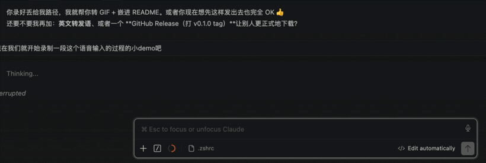
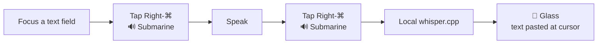
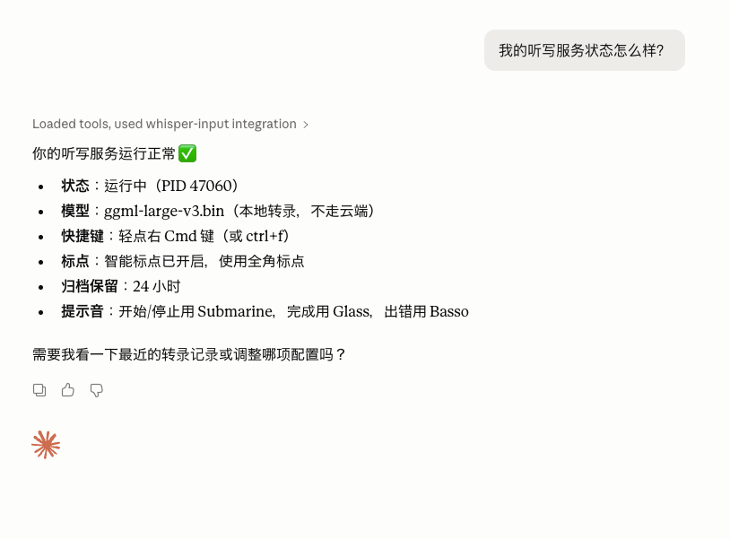

# whisper-input-next-mac-kit

**English** · [中文说明](README_zh-CN.md)

A one-command macOS installer that turns
[**Whisper-Input-Next**](https://github.com/Mor-Li/Whisper-Input-Next) into a polished,
always-on **local** voice keyboard — fully offline, free, and private.

Tap a key, speak, and your words are transcribed on-device by
[whisper.cpp](https://github.com/ggml-org/whisper.cpp) and pasted at your cursor — in any
app, including chat boxes, editors, and IDEs.



> **This kit does not contain or redistribute upstream source code.** The installer clones
> the official Whisper-Input-Next repo onto your machine and layers a few enhancements on
> top. All credit for the core tool goes to the upstream authors — see
> [CREDITS.md](CREDITS.md).

## ✨ What this kit adds on top of upstream

- 🎙️ **Tap Right-⌘ to start/stop** — single-tap toggle, no awkward chord, no app conflicts.
- 🔊 **Audio cues** — *Submarine* on start/stop, *Glass* when the text is pasted. Operate by
  ear; you never need to look at a terminal. Each sound is overridable via env
  (`SOUND_START` / `SOUND_STOP` / `SOUND_DONE` / `SOUND_ERROR` / `SOUND_WARNING`).
- 🧠 **Ctrl+F also routes to local** whisper.cpp (upstream wires local to Ctrl+I only).
- 🚀 **launchd auto-start service** — starts at login, restarts on crash, **no terminal
  window**, runs until you shut down.
- ✍️ **Better Chinese punctuation** (local mode) — prompt-guided punctuation + half→full-width CJK normalization, both configurable.
- 🧹 **Audio-archive auto-cleanup** — old recordings and their cache entries are deleted after
  `AUDIO_ARCHIVE_RETENTION_HOURS` (default 24h), at startup and periodically. Nothing piles up.
- 🤖 **Manage it from Claude Desktop** — a thin [MCP server](mcp/) to check status, read logs, tweak config, and switch models by just *asking* — no UI to build.
- 🩹 **Bug fix** for upstream's `start.sh` dependency check.
- ⚙️ **Turn-key setup** — uv venv, dependencies, `whisper-cpp`, model download, `.env`, and
  the launchd agent, all wired with the correct paths for *your* machine.

## ✅ Requirements

- **macOS** (Apple Silicon recommended), with **[Homebrew](https://brew.sh)** installed.
- ~2 GB free disk for the default model (`large-v3-turbo`); ~3 GB for `large-v3`.
- `git` (`xcode-select --install`). Everything else (`uv`, `ffmpeg`, `whisper-cpp`) is
  installed for you.

## 🚀 Install

```bash
git clone https://github.com/AlexFlanker/whisper-input-next-mac-kit.git
cd whisper-input-next-mac-kit
./install.sh
```

The installer prints exactly what to do next. The **one-time** manual step is granting macOS
permissions (see below) — everything else is automatic.

### One-time permissions

A launchd-launched process must be granted permissions itself (separate from your terminal).
The installer prints the exact Python binary path and opens the right settings pane. Grant
that binary:

| System Settings → Privacy & Security | Why |
|---|---|
| **Input Monitoring** | listen for the hotkey |
| **Accessibility** | paste text at the cursor |
| **Microphone** | record audio |

Then restart the service (the installer prints the exact command) and you're done.

## ▶️ Usage



1. Focus any text field.
2. **Tap Right-⌘** → *Submarine* sound = recording.
3. Speak.
4. **Tap Right-⌘** again → *Submarine* = stopped/transcribing.
5. ~A few seconds later → *Glass* sound = text is auto-pasted at your cursor.

`Ctrl+F` and `Ctrl+I` still work as fallback hotkeys.

## ⚙️ Configuration

Override any of these as environment variables when running `./install.sh`:

| Variable | Default | Notes |
|---|---|---|
| `WIN_MODEL` | `large-v3-turbo` | `large-v3` (max accuracy, ~3 GB, slower), `medium`, `small`, … |
| `WIN_APP_DIR` | `~/Whisper-Input-Next` | where the upstream app is cloned |
| `WIN_LABEL` | `com.whisper-input-next.kit` | launchd label |
| `WIN_COMMIT` | pinned commit | upstream commit the patches target |

```bash
WIN_MODEL=large-v3 ./install.sh   # e.g. install with the full large-v3 model
```

**Runtime knobs** live in the generated `~/Whisper-Input-Next/.env` (edit and restart the
service, or change them from Claude Desktop via the MCP server):

| Key | Default | Notes |
|---|---|---|
| `SOUND_START` / `SOUND_STOP` / `SOUND_DONE` / `SOUND_ERROR` / `SOUND_WARNING` | Submarine / Submarine / Glass / Basso / Funk | any name in `/System/Library/Sounds` |
| `WHISPER_PROMPT` | `以下是一段普通话…` | punctuation-guiding prompt; empty = no punctuation |
| `WHISPER_FULLWIDTH_PUNCT` | `true` | convert half→full-width CJK punctuation |
| `AUDIO_ARCHIVE_RETENTION_HOURS` | `24` | delete recordings older than this; `<0` disables |
| `AUDIO_ARCHIVE_CLEANUP_INTERVAL_HOURS` | `6` | how often the background cleanup runs |

## 🛠️ Managing the service

```bash
launchctl kickstart -k gui/$(id -u)/com.whisper-input-next.kit   # start / restart
launchctl bootout    gui/$(id -u)/com.whisper-input-next.kit     # stop
tail -f ~/Whisper-Input-Next/logs/launchd.err.log                # logs
./uninstall.sh                                                    # remove the service
```

> The menu-bar **Quit** item relaunches due to `KeepAlive`; use `bootout` / `uninstall.sh`
> to actually stop it.

## 🤖 Manage from Claude Desktop (MCP)

Prefer to *ask* instead of remembering `launchctl`? The kit ships a thin
[**MCP server**](mcp/) so you can run the whole thing from Claude Desktop — check status,
read logs, change sounds, switch models — in plain language. No app, no dashboard to build.



One command sets it up (quit Claude Desktop first — it rewrites its own config):

```bash
./install-mcp.sh
```

It installs the `mcp` SDK into the app venv and merges a `whisper-input` entry into Claude
Desktop's config (existing servers untouched). Details + manual steps in
[`mcp/README.md`](mcp/README.md).

## 🔍 How it works

`install.sh` clones upstream at a pinned commit, sets up a uv (Python 3.12) venv, installs
deps + Homebrew `whisper-cpp` + a whisper model, then runs
[`scripts/apply_enhancements.py`](scripts/apply_enhancements.py) — an **idempotent** patcher
that inserts this kit's additions (sound cues, tap toggle, local routing, the `start.sh`
fix). Finally it renders a `.env` and a LaunchAgent `plist` with your machine's paths.

A note on a non-obvious upstream detail the installer handles for you: the app constructs
OpenAI + Kimi helpers at startup, so `.env` must keep three **non-empty placeholder** keys
(`OFFICIAL_OPENAI_API_KEY`, `GROQ_API_KEY`, `KIMI_API_KEY`) even in local-only mode, or it
crashes. The generated `.env` includes them.

## 🗑️ Uninstall

```bash
./uninstall.sh                       # stop & remove the service
rm -rf ~/Whisper-Input-Next          # remove the app (optional)
brew uninstall whisper-cpp           # remove the engine (optional)
```

## 🙏 Credits & license

All credit for the voice tool goes to **[Mor-Li/Whisper-Input-Next](https://github.com/Mor-Li/Whisper-Input-Next)**,
the original **[ErlichLiu/Whisper-Input](https://github.com/ErlichLiu/Whisper-Input)**, and
**[whisper.cpp](https://github.com/ggml-org/whisper.cpp)**. Please read
[**CREDITS.md**](CREDITS.md) — including an honest note on the upstream **license status**
(no explicit LICENSE file upstream) and why this kit does not redistribute their code.

This kit's own code is MIT licensed — see [LICENSE](LICENSE).

## ⚠️ Disclaimer

Not affiliated with or endorsed by the upstream authors. macOS only. Provided as-is; the
license note in CREDITS.md is a good-faith description, not legal advice.
