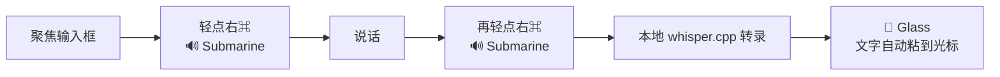

# whisper-input-next-mac-kit

[English](README.md) · **中文说明**

一条命令，把 [**Whisper-Input-Next**](https://github.com/Mor-Li/Whisper-Input-Next) 装成一个开箱即用、常驻后台的**本地**语音键盘——**完全离线、免费、隐私**。

轻点一个键、说话，[whisper.cpp](https://github.com/ggml-org/whisper.cpp) 在你本机把语音转成文字并粘到光标处——任何 App 都能用，包括聊天框、编辑器、IDE。


> **本 kit 不包含、也不再发布上游任何源码。** 安装脚本在你本机从官方仓库克隆 Whisper-Input-Next，再在其上叠加我们的增强。核心工具的全部功劳归上游作者——见 [CREDITS.md](CREDITS.md)。

## ✨ 这个 kit 在上游之上加了什么

- 🎙️ **轻点右 ⌘ 开始/停止**——单键切换，不用别扭的组合键，不和 App 冲突。
- 🔊 **声音提示**——开始/停止是 *Submarine*（声纳），文字粘好是 *Glass*（叮咚）。凭耳朵操作，全程不用盯屏幕。
- 🧠 **Ctrl+F 也走本地** whisper.cpp（上游只把本地绑在 Ctrl+I）。
- 🚀 **launchd 开机自启服务**——登录即启动、崩溃自拉起、**无终端窗口**、常驻到关机。
- 🩹 修复上游 `start.sh` 的依赖检测 bug。
- ⚙️ **全自动**——uv 虚拟环境、依赖、`whisper-cpp`、模型下载、`.env`、launchd 代理，全部按**你这台机器**的真实路径配好。

## ✅ 环境要求

- **macOS**（建议 Apple Silicon），已装 **[Homebrew](https://brew.sh)**。
- 默认模型 `large-v3-turbo` 需约 2GB 空间；`large-v3` 约 3GB。
- `git`（`xcode-select --install`）。其余（`uv`、`ffmpeg`、`whisper-cpp`）会自动帮你装。

## 🚀 安装

```bash
git clone https://github.com/AlexFlanker/whisper-input-next-mac-kit.git
cd whisper-input-next-mac-kit
./install.sh
```

安装器会打印接下来要做的事。**唯一**的手动步骤是授权 macOS 权限（见下），其余全自动。

### 一次性授权

launchd 启动的进程需要把权限授给**它自己**（和你的终端是分开的）。安装器会打印那个 Python 二进制路径并打开对应设置面板。把它授权给：

| 系统设置 → 隐私与安全性 | 用途 |
|---|---|
| **输入监控** | 监听快捷键 |
| **辅助功能** | 把文字粘到光标处 |
| **麦克风** | 录音 |

然后按安装器打印的命令重启服务即可。

## ▶️ 使用方式



1. 聚焦任意输入框。
2. **轻点右 ⌘** → 听到 *Submarine* = 正在录音。
3. 说话。
4. **再轻点右 ⌘** → *Submarine* = 已停止、转录中。
5. 几秒后 → *Glass* 声 = 文字已自动粘到光标处。

`Ctrl+F` 和 `Ctrl+I` 仍可作为备用快捷键。

## ⚙️ 配置

运行 `./install.sh` 时可用环境变量覆盖：

| 变量 | 默认 | 说明 |
|---|---|---|
| `WIN_MODEL` | `large-v3-turbo` | `large-v3`（最高精度，~3GB，更慢）、`medium`、`small`… |
| `WIN_APP_DIR` | `~/Whisper-Input-Next` | 上游 app 克隆到哪 |
| `WIN_LABEL` | `com.whisper-input-next.kit` | launchd 标签 |
| `WIN_COMMIT` | 固定 commit | 补丁针对的上游 commit |

```bash
WIN_MODEL=large-v3 ./install.sh   # 例如用完整 large-v3 模型安装
```

## 🛠️ 管理服务

```bash
launchctl kickstart -k gui/$(id -u)/com.whisper-input-next.kit   # 启动 / 重启
launchctl bootout    gui/$(id -u)/com.whisper-input-next.kit     # 停止
tail -f ~/Whisper-Input-Next/logs/launchd.err.log                # 看日志
./uninstall.sh                                                    # 卸载服务
```

> 菜单栏的「Quit」会因 `KeepAlive` 被自动拉起；要真停用 `bootout` / `uninstall.sh`。

## 🔍 原理

`install.sh` 克隆固定 commit 的上游 → 建 uv (Python 3.12) 环境装依赖 → 装 `whisper-cpp` + 模型 → 跑 [`scripts/apply_enhancements.py`](scripts/apply_enhancements.py)（**幂等**补丁器，插入我们的增强）→ 按你机器路径生成 `.env` 和 LaunchAgent。

一个上游的非显然细节，安装器已替你处理：app 启动时会无条件构造 OpenAI + Kimi 辅助对象，所以即便纯本地模式，`.env` 也必须保留三个**非空占位** key（`OFFICIAL_OPENAI_API_KEY`、`GROQ_API_KEY`、`KIMI_API_KEY`），否则崩溃。生成的 `.env` 已包含它们。

## 🗑️ 卸载

```bash
./uninstall.sh                       # 停止并移除服务
rm -rf ~/Whisper-Input-Next          # 删除 app（可选）
brew uninstall whisper-cpp           # 删除引擎（可选）
```

## 🙏 致谢与许可证

语音工具的全部功劳归 **[Mor-Li/Whisper-Input-Next](https://github.com/Mor-Li/Whisper-Input-Next)**、原始项目 **[ErlichLiu/Whisper-Input](https://github.com/ErlichLiu/Whisper-Input)** 和 **[whisper.cpp](https://github.com/ggml-org/whisper.cpp)**。请阅读 [**CREDITS.md**](CREDITS.md)——其中包含对上游**许可证现状**的诚实说明（上游无显式 LICENSE 文件），以及本 kit 为何不再发布其代码。

本 kit 自身代码为 MIT 许可——见 [LICENSE](LICENSE)。

## ⚠️ 免责声明

与上游作者无隶属/背书关系。仅限 macOS。按原样提供；CREDITS.md 中的许可证说明是善意描述，非法律意见。
